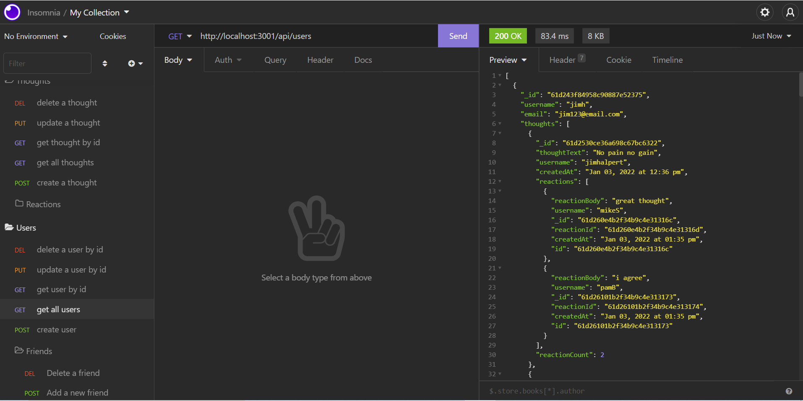

# SOCIAL-NETWORK-API

## Description

- This project is a social media back-end API. It allows users to share their thoughts, are able to react to friend's thoughts, and create a friends list.
- This application uses Express, Node, MongoDB and Mongoose to allow users, thoughts, friend lists and thought reactions to be created, updated and deleted.

## Table of Contents

- [Description](#Description)
- [Installation](#Installation)
- [Usage](#Usage)
- [Assets](#Assets)

## Installation

- You will need Node.js , MongoDB installed on your local machine.

- Clone the repository to your local environment

- git clone https://github.com/SrilalithaN/Social-Network_API

- The dependencies used in this application are "mongoose", "express", "moment" and nodemon is installed as a dev dependency.

- To install the dependencies run `npm install <package-name>` and to install the dependency as a dev dependency run `npm install <package-name> --save--dev `

## Usage

- After installation open the integrated terminal and run ` npm i` to install dependencies

- Then run `npm run dev` or `node start index.js`

- Then go to Insomnia to check the routes.

- The following video showcases the usage of the application

  - [Get all Users and Thoughts and Get users and thoughts by id](https://drive.google.com/file/d/1bcVHY2d_-nAoI6kwfblbSFMCuk1dDZFZ/view?usp=sharing)

  - [ Post,Update,Delete Users](https://drive.google.com/file/d/1raaa4HeR7okqO3R48oTIVIfnA3yIbARJ/view?usp=sharing)

  -  [Post, Update, Delete Thoughts] (https://drive.google.com/file/d/1RV0K5pXSM84X1CsEivRwXAUDguXLFoWj/view?usp=sharing)

  - [Add and Delete a Friend](https://drive.google.com/file/d/1yt1NAA-8kLEhRByPOM9694fOv31t39Ey/view?usp=sharing)

  - [Add and Delete a Reaction](https://drive.google.com/file/d/1eU37H1eo7Ya7fsVOe6IORCpbRnYp--P9/view?usp=sharing)

## Assets

- The following is the screenshot of the application:
  

- The following is the link to the deployed code on github : https://github.com/SrilalithaN/Social-Network_API
